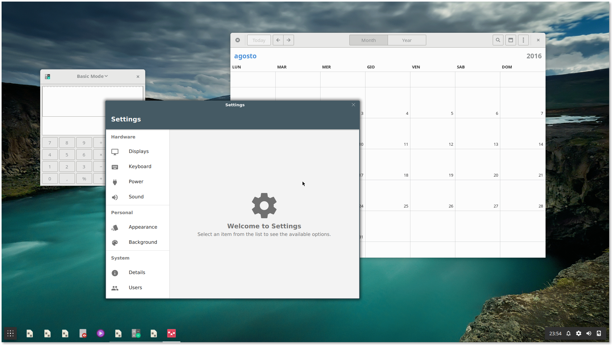

Shell
=====

[](https://zenhub.io)

[](https://www.gnu.org/licenses/gpl-3.0.html)
[](https://github.com/qmlos/shell)
[](https://travis-ci.org/qmlos/shell)
[](https://github.com/qmlos/shell/issues)
[](https://github.com/qmlos/shell/commits/develop)

Responsive shell for qmlOS.



## Dependencies

Qt >= 5.7.0 with at least the following modules is required:

 * [qtbase](http://code.qt.io/cgit/qt/qtbase.git)
 * [qtdeclarative](http://code.qt.io/cgit/qt/qtdeclarative.git)
 * [qtgraphicaleffects](http://code.qt.io/cgit/qt/qtgraphicaleffects.git)
 * [qtquickcontrols](http://code.qt.io/cgit/qt/qtquickcontrols.git)
 * [qtquickcontrols2](http://code.qt.io/cgit/qt/qtquickcontrols2.git)
 * [qtsvg](http://code.qt.io/cgit/qt/qtsvg.git)

The following modules and their dependencies are required:

 * [ECM >= 1.7.0](http://quickgit.kde.org/?p=extra-cmake-modules.git)
 * [greenisland](https://github.com/greenisland/greenisland)
 * [fluid](https://github.com/qmlos/fluid)
 * [qmlos-workspace](https://github.com/qmlos/workspace)
 * [pam](http://www.linux-pam.org/)
 * [libqtxdg](https://github.com/lxde/libqtxdg)

Optional, but recommended dependencies:

 * [hawaii-icon-themes](https://github.com/hawaii-desktop/hawaii-icon-themes) for the default icon theme
 * [hawaii-wallpapers](https://github.com/hawaii-desktop/hawaii-wallpapers) for the default wallpaper

If you do not install those dependencies, please configure the desktop with an
alternative icon theme and wallpaper.

## Installation

From the root of the repository, run:

```sh
mkdir build; cd build
cmake .. -DKDE_INSTALL_USE_QT_SYS_PATHS=ON
make
make install # use sudo if necessary
```

On the `cmake` line, you can specify additional configuration parameters:

 * `-DCMAKE_INSTALL_PREFIX=/path/to/install` (for example, `/opt/qmlos` or `/usr`)
 * `-DCMAKE_BUILD_TYPE=<build_type>`, where `<build_type>` is one of:
   * **Debug:** debug build
   * **Release:** release build
   * **RelWithDebInfo:** release build with debugging information

## Licensing

Licensed under the terms of the GNU General Public License version 3 or,
at your option, any later version.

## Notes

### Logging categories

Qt 5.2 introduced logging categories and Hawaii takes advantage of
them to make debugging easier.

Please refer to the [Qt](http://doc.qt.io/qt-5/qloggingcategory.html) documentation
to learn how to enable them.

### Available categories

 * Compositor:
   * **hawaii.compositor:** Compositor
   * **hawaii.processlauncher:** Process launcher and application tracker
   * **hawaii.screensaver:** Lock, idle and inhibit interface
   * **hawaii.session:** Manages the session
   * **hawaii.loginmanager:** login manager subsystem
   * **hawaii.loginmanager.logind:** login manager subsystem (logind backend)

 * Launcher QML plugin:
   * **hawaii.qml.launcher:** Launcher model and items
   * **hawaii.qml.launcher.appsmodel:** Applications model

## Components

*hawaii*

Compositor executable that links to Green Island.

*hawaii-session*

Manages the session, drives the compositor, runs autostart programs
and launches applications for the application launcher.

Autostarts the D-Bus session if needed and can logout an existing
session with:

```sh
hawaii-session --logout
```

Supports the following modes:

* **eglfs:** runs the compositor directly on KMS or other supported systems
* **hwcomposer:** runs the compositor directly with Android drivers
* **nested:** runs the compositor inside Weston

For **eglfs** mode the user must be in the ``video`` and ``input`` groups.
KMS support requires Qt 5.5 or better.
libinput is automatically used with Qt 5.5 or better, built with libinput support.

For **hwcomposer** mode the user must be in the ``video`` and ``input`` groups.
libinput is automatically used with Qt 5.5 or better, built with libinput support.

The mode can be specified with the ``--mode`` argument, here's an example:

```sh
hawaii-session --mode=eglfs
```

The best mode is automatically detected if you run ``hawaii-session``
without the ``--mode`` argument.

## QML JavaScript debugger

Developers can debug Hawaii Shell with Qt Creator and the QML JavaScript debugger.

Run Hawaii setting the debugger port:

```sh
HAWAII_SHELL_DEBUG_PORT=3768 hawaii
```

In the example above we are using the default port which is 3768.
Now from Qt Creator click on Debug -> Start Debugging -> Attach to QML port and specify
the 3768 port.

See the [Qt Creator manual](http://qt-project.org/doc/qtcreator-3.0/creator-debugging-qml.html) for more information.
